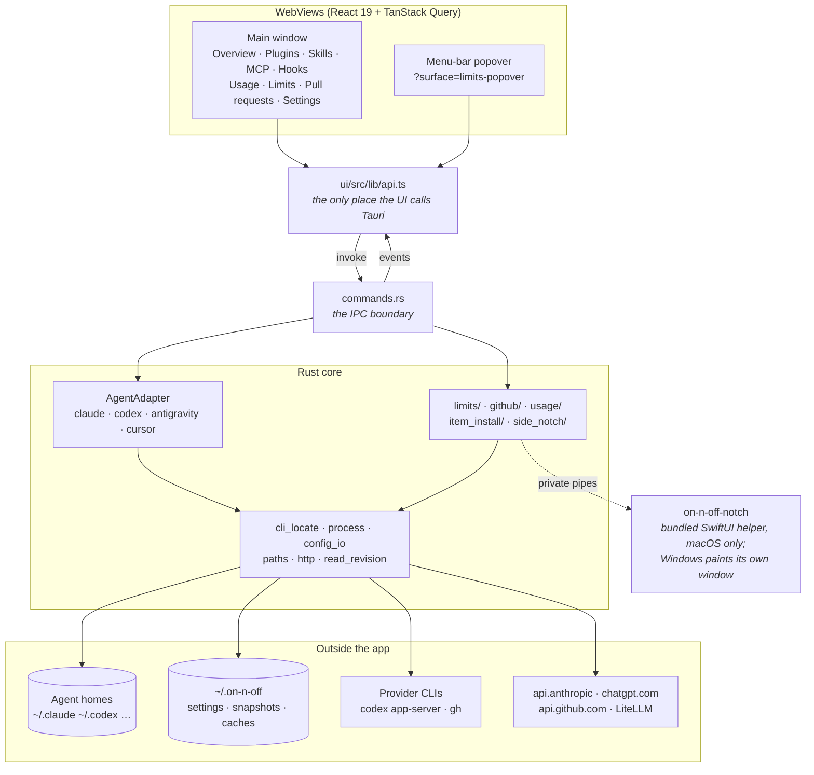
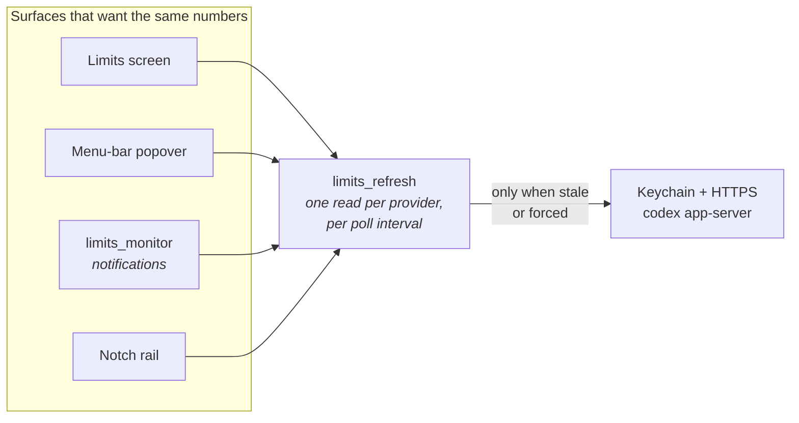
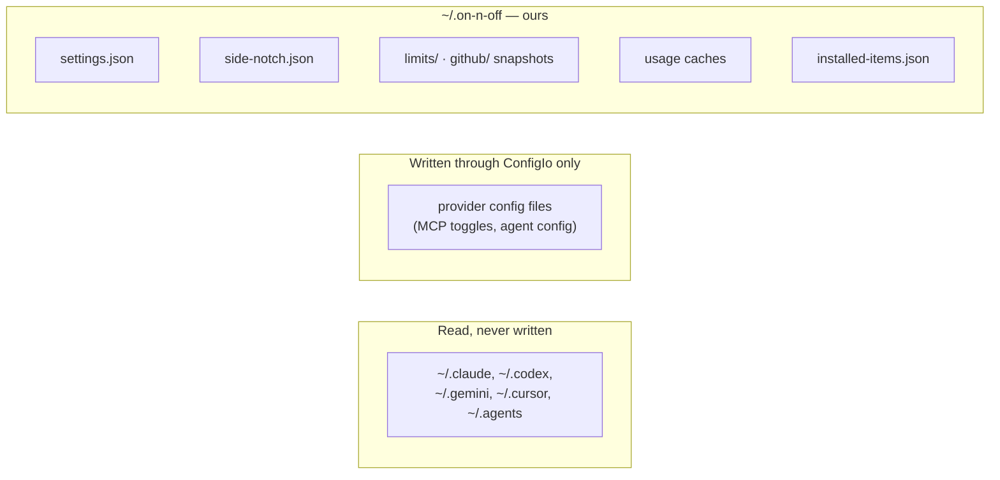

# Architecture

How on-n-off is put together, for orientation.

**This is not a source of truth. The code is.** These notes and diagrams exist so you know where
to look and which pieces talk to which; when they disagree with `src-tauri/` or `ui/`, the code is
right and this file is stale. Fix it in passing or leave it — never "fix" the code to match a
diagram here.

Where files are, how to run them, and the constraints the code must respect all live in
[`../../AGENTS.md`](../../AGENTS.md).

## What it is

A Tauri 2 desktop app for Windows and macOS (Apple Silicon) that reads what your coding agents —
Claude, Codex, Antigravity, Cursor — have on disk, and shows it in one place: installed plugins,
skills, MCP servers, the hooks a provider would run (Claude and Codex, listed and never run),
token usage and cost, subscription rate limits, and your GitHub pull requests. It is overwhelmingly a **reader**; the narrow set of things it writes is listed under
"Constraints" in AGENTS.md.

## The shape of the process

Two things to hold onto:

- **`commands.rs` is the only door.** The UI reaches Rust through `$lib/api`, which reaches
  `commands.rs`, and nothing else. Feature components never invoke Tauri directly.
- **The notch is not a WebView.** On macOS it is a bundled Swift helper in its own process: Rust
  owns its settings and feeds it snapshots over bounded private pipes, and it draws and reports
  back typed actions. No credentials cross that pipe and it opens no listener. On Windows there is
  no helper — the app paints a layered overlay window itself over in-process channels.

## Reads, and why they are shared

Almost every screen is a view over an expensive read: spawning `codex app-server`, unlocking the
Keychain, a GraphQL round trip, or a scan of transcript files. Several surfaces want the same read
at the same time, so each such read is cached once per process and shared.

The same pattern holds for pull requests (`github` + `github_monitor` + the notch's PR cell). The
consequence — that a surface holding its own copy has to be told when another one refreshes — is
the subject of [shared-reads.md](shared-reads.md), and it is the part most easily got wrong.

## Feature subsystems

Each is a directory under `src-tauri/src/`; the module doc-comment at the top of its `mod.rs` is
the real explanation. What follows is only enough to know which one you want.

| Subsystem | What it does | Notable |
| --- | --- | --- |
| `{claude,codex,antigravity,cursor}.rs` | Provider adapters behind `AgentAdapter` | Every provider difference belongs here. Layout per provider is in `PROVIDERS.md`. |
| `scanner.rs`, `plugin_meta.rs`, `mcp.rs` | Plugins, skills and MCP servers for a provider | Feeds Overview, Plugins, Skills, MCP. |
| `usage/` | Token and cost aggregation from transcripts | Read-only. See below. |
| `limits/` + `limits_refresh.rs` | Live subscription rate limits | Provider problems come back as a `status` on the DTO, never an `Err`. See below. |
| `github/` + `github_monitor.rs` | The Pull requests screen and its CI notifications | Not a provider, not behind `AgentAdapter`. See below. |
| `item_install/` | Installing skills/subagents from a GitHub marketplace | The only substantial writer. Atomic placement plus a provenance registry at `~/.on-n-off/installed-items.json`, so upstream changes stay visible after the user edits their copy. |
| `side_notch/` | The notch overlay, macOS and Windows 11 | See [side-notch.md](side-notch.md). |
| `monitor.rs` | Shared polling/notification plumbing | `limits_monitor` and `github_monitor` are both built on it; they poll while the window is hidden. |

### Accounts

The opt-in [account manager](accounts.md) saves protected renewable profiles and explicitly changes
the default native CLI login. Active credentials remain native-owned. Inactive profiles never
refresh in the background. Config, plugins, MCP settings and sessions are preserved.

### Limits

Each provider is read the way that provider intends, and active login renewal remains native-store-owned:

- **Claude** — read the stored access token (macOS Keychain via `/usr/bin/security`, else
  `~/.claude/.credentials.json`), verify it against `/api/oauth/profile`, then read
  `/api/oauth/usage`.

  That token lives eight hours and Claude Code renews it only while Claude Code is running, so
  on-n-off — which runs continuously — renews it too rather than reporting an expired login at a
  signed-in user. `accounts/claude_renew.rs` is the only place that reads the refresh token or
  writes Claude's store, and it does the same thing Claude Code does: the same two lock
  directories in the same order, the same grant against the same client id, the same stored shape,
  and a re-read under the lock so a login another process just renewed is used rather than
  redeemed again.

  The work is ordered around the redemption, because that is the point of no return: the issuer
  rotates the refresh token, so from the reply until the store is written the only live credential
  is a value on the stack. Everything that can fail on its own account — resolving the Keychain
  entry's account, proving the credentials file's directory will take a temporary — happens
  *before* the grant, leaving one `rename` or one `security -U` after it. A refresh token the
  issuer refuses is reported as needing a new sign-in, and not sent again while the store still
  holds it; a renewal that succeeds and then cannot be stored says exactly that, with the reason,
  because by then the old token is spent and only signing in again will clear it.
- **Codex** — launch the official `codex app-server` and call `account/read` plus
  `account/rateLimits/read`. Codex owns its own login and refresh; on-n-off reads only
  `account_id` metadata from the app-server's confirmed home. The same read reports banked
  rate-limit resets (`rateLimitResetCredits`). Spending one is the only write Limits makes:
  `account/rateLimitResetCredit/consume`, from an explicit click on the signed-in account's card,
  after checking that the native login is still that account, and never while an account change
  holds the Codex activity lease. With 5% or more usage left the UI asks first. A shared forced
  read follows every attempt that got past that lease, a failed one included, since a request that
  timed out may still have reached Codex; and the card reuses one idempotency key until Codex gives
  a definite answer, so a retry cannot spend a second reset.

Because each CLI stores one login at a time, successful reads are remembered per account (numbers
only, under `~/.on-n-off/limits/`) so an account the user has switched away from stays visible
with its last observation time rather than vanishing.

### Pull requests

One GraphQL request per refresh reads authored (scoped), review-requested and assigned PRs with
their CI rollups and merge state. Problems come back as a `status` + `hint` on the DTO, backed by the
last snapshot under `~/.on-n-off/github/`. Auth is borrowed from `gh auth token`, memoised per
app run, re-read once on a 401, never persisted.

The merge fields — `mergeable` for conflicts, `mergeStateStatus` for ready/blocked/behind,
`mergeQueueEntry`, `autoMergeRequest` — are scalars and single objects on purpose, so the request
costs about 2 rate-limit points. They are interpreted in exactly one place, `github/merge.rs`:
`classify` fills `mergeKind` on the DTO, the screen only maps kinds to badges, and the monitor's
`Seen` record takes its unknown-aware facts from the same module. Snapshots written before those
fields existed load with `Unknown`/`false` defaults.

The monitor notifies on CI, review-decision, conflict and ready-to-merge transitions of the
authored PRs the screen lists — the scoped first page of fifty. It is opt-in and polls while the
window is hidden.

### Usage

Transcript aggregation, entirely read-only, with caches under `~/.on-n-off/`. Prices come from
LiteLLM's public table (`usage/pricing.rs`), cached for a day. A scan that meets a
priceable-looking model the table lacks lets the next scan re-fetch after an hour, and the Usage
refresh button re-fetches at once. The summary cache key carries the table's fetch time, so a new
table can never serve costs computed from an old one.

## Cross-cutting plumbing

| Module | Why it exists |
| --- | --- |
| `cli_locate.rs` | A GUI app does not inherit a terminal's `PATH`. Builds one merged search list and hands it to spawned CLIs as their `PATH`. |
| `process.rs` | Child-process draining with a hard deadline; stdout and stderr drained concurrently, or a full pipe deadlocks. |
| `config_io.rs`, `backup.rs` | Every provider-config write: backup → atomic replace → validate → rollback. |
| `paths.rs` | Agent homes and app data paths. `ON_N_OFF_HOME` redirects them for tests. |
| `read_revision.rs` | Tells every surface when a shared cached read has been replaced. See [shared-reads.md](shared-reads.md). |
| `http.rs` | Outbound HTTPS, plus the loopback test server the limits and github suites drive. |
| `dto.rs` | The serialized shapes crossing the IPC boundary. Changing one is a compatibility event. |

## Where the state lives

Snapshots under `~/.on-n-off/` exist so a signed-out account or an offline launch still shows the
last trustworthy numbers rather than an empty screen. They are numbers and metadata — never
credentials.
