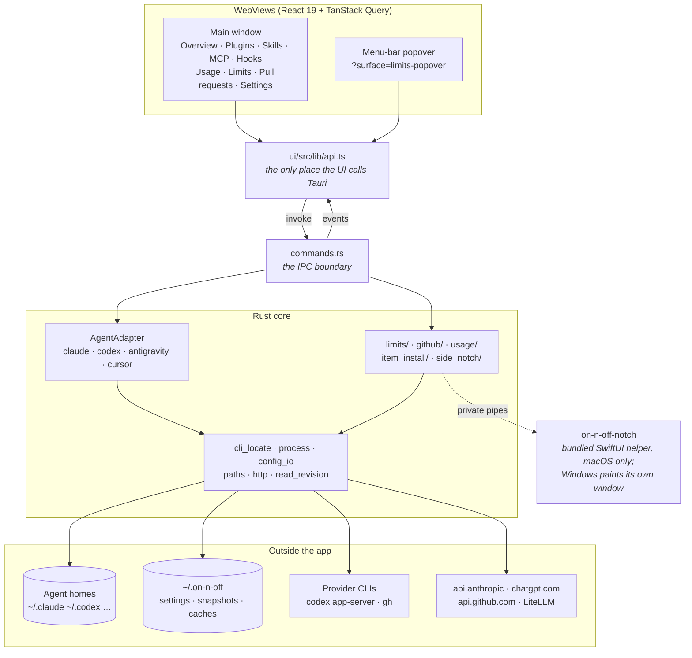
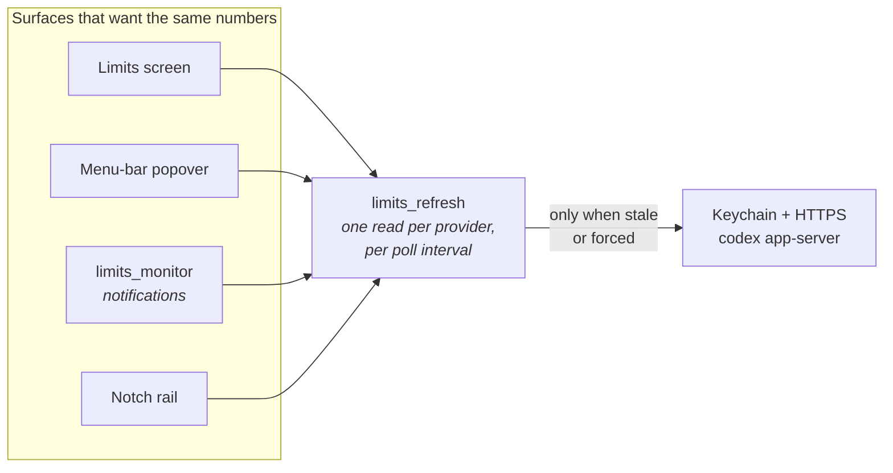
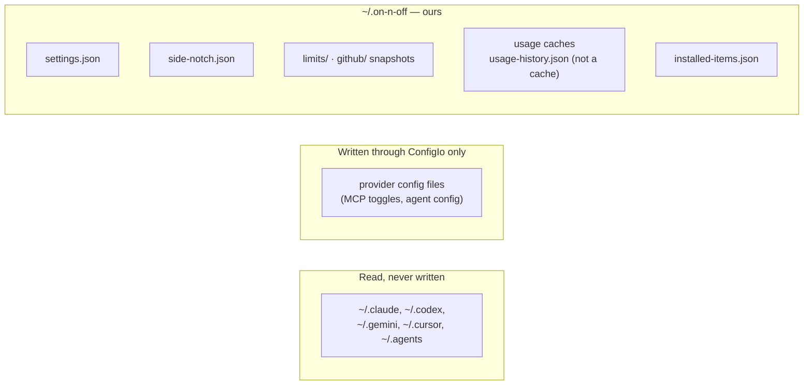

# Architecture

How on-n-off is put together, for orientation.

**This is not a source of truth. The code is.** These notes and diagrams exist so you know where
to look and which pieces talk to which; when they disagree with `src-tauri/` or `ui/`, the code is
right and this file is stale. Fix it in passing or leave it — never "fix" the code to match a
diagram here.

Where files are, how to run them, and the constraints the code must respect all live in
[`../../AGENTS.md`](../../AGENTS.md).

## What it is

A Tauri 2 desktop app for Windows and macOS (Apple Silicon) that reads what your coding agents —
Claude, Codex, Antigravity, Cursor — have on disk, and shows it in one place: installed plugins,
skills, MCP servers, the hooks a provider would run (Claude and Codex, listed and never run),
token usage and cost, subscription rate limits, and your GitHub pull requests. It is
overwhelmingly a **reader**; the narrow set of things it writes is listed under "Constraints" in
AGENTS.md.

## The shape of the process

Two things to hold onto:

- **`commands.rs` is the only door.** The UI reaches Rust through `$lib/api`, which reaches
  `commands.rs`, and nothing else. Feature components never invoke Tauri directly.
- **The notch is not a WebView.** On macOS it is a bundled Swift helper in its own process: Rust
  owns its settings and feeds it snapshots over bounded private pipes, and it draws and reports
  back typed actions. No credentials cross that pipe and it opens no listener. On Windows there is
  no helper — the app paints a layered overlay window itself over in-process channels.

## Reads, and why they are shared

Almost every screen is a view over an expensive read: spawning `codex app-server`, unlocking the
Keychain, a GraphQL round trip, or a scan of transcript files. Several surfaces want the same read
at the same time, so each such read is cached once per process and shared.

The same pattern holds for pull requests (`github` + `github_monitor` + the notch's PR cell). The
consequence — that a surface holding its own copy has to be told when another one refreshes — is
the subject of [shared-reads.md](shared-reads.md), and it is the part most easily got wrong.

## Feature subsystems

Each is a directory under `src-tauri/src/`; the module doc-comment at the top of its `mod.rs` is
the real explanation. What follows is only enough to know which one you want.

| Subsystem | What it does | Notable |
| --- | --- | --- |
| `{claude,codex,antigravity,cursor}.rs` | Provider adapters behind `AgentAdapter` | Every provider difference belongs here. Layout per provider is in `PROVIDERS.md`. |
| `scanner.rs`, `plugin_meta.rs`, `mcp.rs` | Plugins, skills and MCP servers for a provider | Feeds Overview, Plugins, Skills, MCP. |
| `usage/` | Token and cost aggregation from transcripts, and the usage kept after they are deleted | Read-only on agent homes. See below. |
| `limits/` + `limits_refresh.rs` | Live subscription rate limits | Provider problems come back as a `status` on the DTO, never an `Err`. See below. |
| `github/` + `github_monitor.rs` | The Pull requests screen and its CI notifications | Not a provider, not behind `AgentAdapter`. See below. |
| `item_install/` | Installing skills/subagents from a GitHub marketplace | The only substantial writer. Atomic placement plus a provenance registry at `~/.on-n-off/installed-items.json`, so upstream changes stay visible after the user edits their copy. |
| `side_notch/` | The notch overlay, macOS and Windows 11 | See [side-notch.md](side-notch.md). |
| `monitor.rs` | Shared polling/notification plumbing | `limits_monitor` and `github_monitor` are both built on it; they poll while the window is hidden. |

### Accounts

The opt-in [account manager](accounts.md) saves protected renewable profiles and explicitly changes
the default native CLI login. Active credentials remain native-owned. Inactive profiles never
refresh in the background. Config, plugins, MCP settings and sessions are preserved.

### Limits

Each provider is read the way that provider intends, and active login renewal remains native-store-owned:

- **Claude** — read the stored access token from the store Claude Code itself reads
  (`accounts/claude_store.rs`: in the dirs Claude Code resolves from `CLAUDE_CONFIG_DIR` and
  `CLAUDE_SECURESTORAGE_CONFIG_DIR`, its macOS Keychain item via `/usr/bin/security` when that
  parses, else the storage dir's `.credentials.json`), verify it against `/api/oauth/profile`,
  then read
  `/api/oauth/usage?cedar_ember=1&skip_spend=1`. The query adds the saved rate-limit resets
  (`cedar_ember`) to the same answer. It is optional: a refused query falls back to the plain read
  rather than failing it, and a read that cannot tell keeps the remembered count. The resets are
  reported, never spent: Claude Code's `/limit-reset` spends the signed-in account's.

  That token lives eight hours and Claude Code renews it only while Claude Code is running, so
  on-n-off — which runs continuously — renews it too rather than reporting an expired login at a
  signed-in user. `accounts/claude_renew.rs` is the only place that redeems the refresh token,
  and it does the same thing Claude Code does, through `accounts/claude_store.rs` for everything
  about the store: the same refresh lock directories in the same order (`.oauth_refresh.lock`,
  then the legacy lock beside the config dir's real path), kept fresh while held; the same
  `.storage-write.lock` around the read and the write, taken by the one writer the account switch
  uses too; the same grant against the login's own client id; the same stored shape; and a re-read
  under the locks so a login another process just renewed is used rather than redeemed again.

  The work is ordered around the redemption, because that is the point of no return: the issuer
  rotates the refresh token, so from the reply until the store is written the only live credential
  is a value on the stack. Everything that can fail on its own account — resolving the Keychain
  entry's account, creating a private temporary beside the credentials file, refusing one that is
  a link — happens *before* the grant, leaving one `security -U` or one synced rename after it. A refresh token the
  issuer refuses is reported as needing a new sign-in, and not sent again while the store still
  holds it; a renewal that succeeds and then cannot be stored says exactly that, with the reason,
  because by then the old token is spent and only signing in again will clear it.
- **Codex** — launch the official `codex app-server` and call `account/read` plus
  `account/rateLimits/read`. Codex owns its own login and refresh; on-n-off reads only
  `account_id` metadata from the app-server's confirmed home. The same read reports banked
  rate-limit resets (`rateLimitResetCredits`). Spending one is the only write Limits makes:
  `account/rateLimitResetCredit/consume`, from an explicit click on the signed-in account's card,
  after checking that the native login is still that account, and never while an account change
  holds the Codex activity lease. With 5% or more usage left the UI asks first. A shared forced
  read follows every attempt that got past that lease, a failed one included, since a request that
  timed out may still have reached Codex; and the card reuses one idempotency key until Codex gives
  a definite answer, so a retry cannot spend a second reset.

Because each CLI stores one login at a time, successful reads are remembered per account (numbers
only, under `~/.on-n-off/limits/`) so an account the user has switched away from stays visible
with its last observation time rather than vanishing. What a later read keeps of that remembered
reading, after it answers and after it fails, is one policy for every writer, in
`limits/reading.rs`.

### Pull requests

One GraphQL request per refresh reads authored (scoped), review-requested and assigned PRs with
their CI rollups and merge state. Problems come back as a `status` + `hint` on the DTO, backed by the
last snapshot under `~/.on-n-off/github/`. Auth is borrowed from `gh auth token`, memoised per
app run, re-read once on a 401, never persisted.

The merge fields — `mergeable` for conflicts, `mergeStateStatus` for ready/blocked/behind,
`mergeQueueEntry`, `autoMergeRequest` — are scalars and single objects on purpose, so the request
costs about 2 rate-limit points. They are interpreted in exactly one place, `github/merge.rs`:
`classify` fills `mergeKind` on the DTO, the screen only maps kinds to badges, and the monitor's
`Seen` record takes its unknown-aware facts from the same module. Snapshots written before those
fields existed load with `Unknown`/`false` defaults.

The monitor notifies on CI, review-decision, conflict and ready-to-merge transitions of the
authored PRs the screen lists — the scoped first page of fifty. It is opt-in and polls while the
window is hidden.

### Usage

Transcript aggregation, entirely read-only, with caches under `~/.on-n-off/`. Prices come from
LiteLLM's public table (`usage/pricing.rs`), cached for a day. A scan that meets a
priceable-looking model the table lacks lets the next scan re-fetch after an hour, and the Usage
refresh button re-fetches at once. The summary cache key carries the table's fetch time, so a new
table can never serve costs computed from an old one.

The summary and the background fold read transcripts the same way, through `usage/sources.rs`,
under the one lock every read and write of the usage files takes. `Sources::open` walks the roots
and brings the source index up to date, which is enough to answer the summary's cache check before
any record is read. `Sources::read` then returns the records, from each transcript's cached parse
where it still holds, and `Sources::finish` saves the scan cache, pruned with the watermark it is
given, and releases the lock. Every path out of a read runs it, a summary served from the cache
included, so what bringing the index up to date parsed is never parsed again.

Three reading rules carry the accuracy, each pinned by a test:

- **One record per copy group, its richest copy, before anything is counted.** Claude Code writes
  one line per content block of a message, all under one `message.id` and `requestId`, and the
  early lines carry a partial `output_tokens` (often 1 for a thinking block); a resumed or forked
  session copies messages into other transcripts too. A Codex rollout listed under both roots (a
  rename between the walks, or a stale entry after an incomplete walk) repeats its session's events
  at the same instants. `transcripts::richest_copies` collapses both over every file of the scan,
  so the totals and the session counts follow the copy that is counted.
- **Cache writes by lifetime.** A one-hour Claude cache write
  (`usage.cache_creation.ephemeral_1h_input_tokens`) is priced at LiteLLM's
  `cache_creation_input_token_cost_above_1hr`, 2x input when the table omits it; a five-minute
  write at `cache_creation_input_token_cost`.
- **Archived Codex sessions still count.** Codex moves an archived session's rollout to
  `~/.codex/archived_sessions/`, mtime intact; it is scanned as a second Codex root under the one
  Codex source.

A transcript still being written while it is read (a live session) counts what it holds at that
moment instead of dropping out of the total. A read parses a file up to twice and reports whether
its size and mtime held still (`TranscriptRead`, in `usage/sources/source_index.rs`):

- A file that held still but no longer matches the inventory counts what it holds now.
- One that kept moving, or went away after a parse, counts the last parse that succeeded.
- One no parse succeeded on counts its last cached parse, if there is one.

None of these parses is cached, and the summary is not stored as final, so the next refresh reads
the file again.

A model the table has no price for is shown as **unpriced**, never as `$0.00`: its tokens count
and its cost is left out of the total, which says how many models it leaves out. Any change to
what a transcript parses to bumps `USAGE_TRANSCRIPT_PARSER_VERSION`, which invalidates every
cache, so what the transcripts still hold is re-read from them; nothing in an agent home is ever
written.

Claude Code sets a replaced transcript aside as `<session>.jsonl.superseded-<ms>` rather than
overwriting it. Those are read too, so a turn a rewrite dropped still counts; the turns both copies
hold collapse to one.

#### Usage history

Claude Code deletes transcripts after `cleanupPeriodDays` (30 by default), so a count read only
from transcripts shrinks as they go. `usage/history.rs` keeps what they held in
`~/.on-n-off/usage-history.json`. That file is user data, not a cache: once the transcripts are
gone nothing can rebuild it.

- **What is kept.** Records older than a week are folded into rows keyed by 15-minute UTC slot,
  provider, model, whether the provider reported the cost, and whether the request's input passed
  200k tokens. A row holds token totals, record count, summed reported cost and the session ids of
  its slot: numbers, model names and session ids, never conversation content. Every UTC offset in
  use is a multiple of 15 minutes, so a slot never straddles a local midnight or hour, and prices
  are linear per model, so a row reads exactly like its records in any time zone and with any
  newer price table. The 200k flag keeps a later long-context price possible for folded usage.
- **The watermark.** Rows cover every record before `foldedThroughMs`; a read counts a
  transcript's records only from it on, so the copies a resumed session makes of folded messages
  are not counted twice. It moves forward only, to the UTC midnight a week before now, so a fold
  runs at most once a day. A transcript whose records all sit below it (or that was last written
  36 hours before it) leaves the scan cache and is never parsed again, even after an index rebuild.
- **When it folds.** Only in `usage/folding.rs`'s background thread, 90 seconds after launch and
  hourly after that, so usage is kept even if the screen is never opened; a Usage read only reads
  the history. A fold needs every root walked and every transcript that may hold a record in range
  read, now or from its cached parse; a transcript still being written counts what it holds,
  since its records old enough to fold were written days ago. Otherwise it waits for the next
  check. A transcript that cannot be read holds it back until it is a week past the cutoff and has
  failed on two checks in a row: by then it never will read, and waiting longer would let the
  provider delete the rest.
- **Summaries.** The summary cache key carries the history file's size and mtime, so a fold or a
  clear never serves a summary counted with the history before it, and a summary counted while
  the file did not read is not stored.
- **When the file does not read.** It is never written over: the previous good file is kept as
  `.bak` and read in its place, and the unreadable one is copied aside under a new name before
  the new file replaces it. A file a newer on-n-off wrote, or one with no readable backup, is left
  alone; Usage counts transcripts alone until the user clears it. A history is written only once
  it reads back as itself, and a file whose rows are out of slot order or at or past its
  watermark does not read.
- **Limits.** A parser fix reaches only records newer than the watermark. A transcript that shows
  up later holding records older than it (copied from another machine, restored from a backup)
  is not counted. A wall clock far ahead at a fold sets the watermark ahead with it, hiding usage
  recorded after the clock is corrected until real time passes it; Clear recovers. A provider set
  to delete transcripts sooner than about nine days (Claude Code's `cleanupPeriodDays` under 9)
  deletes them before they are old enough to fold. Settings shows
  how far back the history reaches and can clear it; clearing forgets what only the history held
  and counts what the transcripts still hold again.

## Cross-cutting plumbing

| Module | Why it exists |
| --- | --- |
| `cli_locate.rs` | A GUI app does not inherit a terminal's `PATH`. Builds one merged search list and hands it to spawned CLIs as their `PATH`. |
| `process.rs` | Child-process draining with a hard deadline; stdout and stderr drained concurrently, or a full pipe deadlocks. |
| `config_io.rs`, `backup.rs` | Every provider-config write: backup → atomic replace → validate → rollback. |
| `paths.rs` | Agent homes and app data paths. `ON_N_OFF_HOME` redirects them for tests. |
| `read_revision.rs` | Tells every surface when a shared cached read has been replaced. See [shared-reads.md](shared-reads.md). |
| `http.rs` | Outbound HTTPS, plus the loopback test server the limits and github suites drive. |
| `dto.rs` | The serialized shapes crossing the IPC boundary. Changing one is a compatibility event. |

## Where the state lives

Snapshots under `~/.on-n-off/` exist so a signed-out account or an offline launch still shows the
last trustworthy numbers rather than an empty screen. They are numbers and metadata — never
credentials.

## Glossary

The words are defined in [`CONTEXT.md`](../../CONTEXT.md). This table says where each one lives in
the code today; a change that moves one updates its row.

| Term | Where it lives |
| --- | --- |
| Quota window | `LimitWindowDto` (`dto/limits.rs`) |
| Reading | `Reading` (`dto/limits.rs`), flattened into `ProviderLimitsDto` and the snapshot file; built by `limits/pipeline.rs` |
| Figure | the optional fields `Reading::has_figures` lists, plus `subscription` and `reset_offer` |
| Account details | `plan` and `subscription_status` on `Reading` |
| Remembered reading | `SnapshotStore` (`limits/snapshots.rs`); what a fresh read keeps from it is the remember policy, `Reading::keeping` (`limits/reading.rs`) |
| Native store | `NativeStore` (`accounts/native.rs`); for Claude, where the login lives, how it is read and written and Claude Code's locks around it are `accounts/claude_store.rs` |
| Saved profile | `Profile` in the vault's `Database` (`accounts/store.rs`); listed and changed through `Accounts` (`accounts/mod.rs`) |
| Account change | `Store::change` (`accounts/store.rs`) with `ChangeKind::Account` (save, remove, use, sign out, in `accounts/mod.rs`), `ChangeKind::SignIn` (a sign-in's publication, `accounts/login.rs`) or `ChangeKind::Recovery` |
| Transcript source | `Sources` (`usage/sources.rs`), which owns the source index (`usage/sources/source_index.rs`) and the scan cache (`usage/sources/scan_cache.rs`) |
| Watermark | `Watermark` (`usage/history.rs`) |
| Folded usage | `HistoryStore` (`usage/history.rs`), folded by `usage/folding.rs` |
