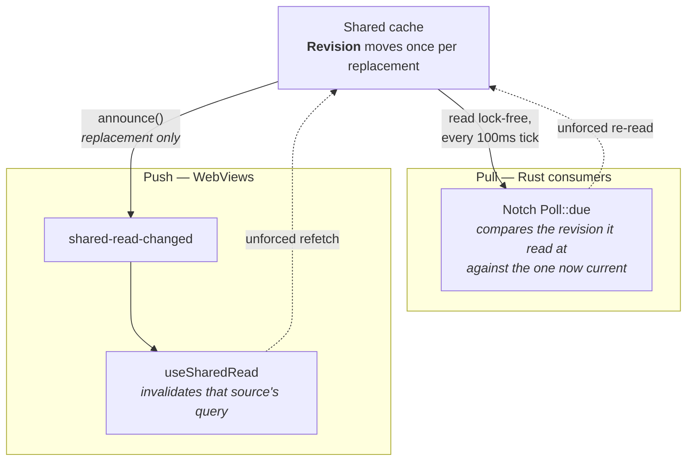
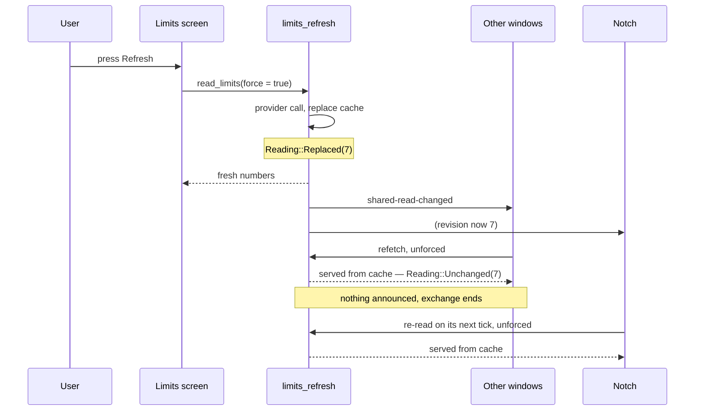

# Shared cached reads

**Orientation, not a source of truth.** `src-tauri/src/read_revision.rs` and its module
doc-comment are authoritative.

## The problem

An expensive read — spawning `codex app-server`, unlocking the Keychain, a GitHub GraphQL round
trip — is made once per process and shared by every surface that wants it. But those surfaces also
each keep their **own copy** of the answer: the notch keeps one per cell so it can draw while a
read is in flight, and each WebView keeps a TanStack Query cache. A copy cannot tell a cache it
has already seen from one another surface has just replaced.

Left there, pressing Refresh on the Limits screen replaced the shared cache immediately while the
notch went on showing the old observation for up to `limitsPollMinutes` — five minutes by default,
thirty at the slowest setting. The same gap ran the other way: a monitor read that found fresher
numbers left both screens on their last answer.

## The mechanism

Two directions, because the Rust consumers can poll a counter and the WebViews cannot.

The `Revision` sits *outside* the mutex guarding the cache, because a read holds that mutex for
the whole of its provider call and asking "is there anything newer?" must never block behind one.

## The two rules

Both are load-bearing. Breaking either turns this into a loop.

**1. Announce a replacement, never a read.**

A read reports a `Reading` — `Replaced(revision)` or `Unchanged(revision)` — and only `Replaced`
is announced. The read a consumer makes in answer is served the value already there, reports
`Unchanged`, and announces nothing. That is what ends the exchange.

**2. Answer an announcement unforced.**

`force` bypasses the cache and belongs to a person pressing refresh. A forced answer would call
the provider, replace the read, and announce again — without end. Both `useSharedRead` and the
notch's poll are tested for this.

## The asymmetry worth knowing

The two caches behave differently on failure, and it is deliberate:

- **`limits_refresh` remembers a failed read** and can serve it, so a failure is a replacement and
  is announced. Everyone converges on the same error message, and the follow-up reads are served
  from the cache rather than hammering a provider that is down.
- **`github` discards its remembered result** on failure, so a failure reports `Unchanged`.
  Announcing it would send the Pull requests screen, the CI monitor and the notch straight back to
  `api.github.com` for the request the reader was just told it could not make.

A new shared read must decide which of those it is before it decides whether to announce.
