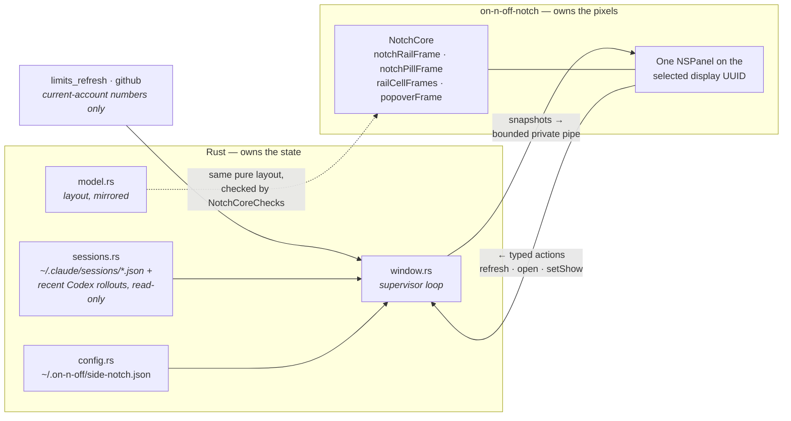

# The macOS side notch

**Orientation, not a source of truth.** `src-tauri/src/side_notch/` and
`src-tauri/macos/SideNotch/` are authoritative.

An opt-in overlay on macOS that keeps quota rings and pull requests visible without the app window
being open. It is the only part of the product that is not a WebView, and the only one that ships
a second executable.



Things that are easy to get wrong:

- **Rust owns settings and data; the helper owns drawing.** The settings card stays in
  `ui/src/features/notch/`. The helper reports typed actions and never edits configuration
  directly.
- **The display is chosen explicitly, by UUID.** A disconnected or mirrored selection hides the
  notch rather than falling back to another screen — silently moving it is worse than not showing.
- **The layout maths exists twice on purpose**, in `NotchCore` (Swift) and `side_notch/model.rs`
  (Rust), so Rust can reason about geometry without calling into AppKit. `NotchCoreChecks` exists
  to keep the two in step; if you change one, change both.
- **Nothing sensitive crosses the pipe** — current-account numbers, session rows, PR rows. No
  credentials, no network listener. PR rows open in the browser and copy a link to the pasteboard;
  the helper never writes to GitHub.
- **The helper is invisible to ordinary screenshots.** Verify it with the `--render` PNG path and
  `scripts/check-native-notch.mjs`, not with `screencapture`.

Built by `native_build.rs` on macOS only and bundled through `tauri.macos.conf.json`. Native
checks run without an Xcode XCTest dependency:

```sh
xcrun swift run --package-path src-tauri/macos/SideNotch NotchCoreChecks
bun scripts/check-native-notch.mjs   # after a Rust build
```
