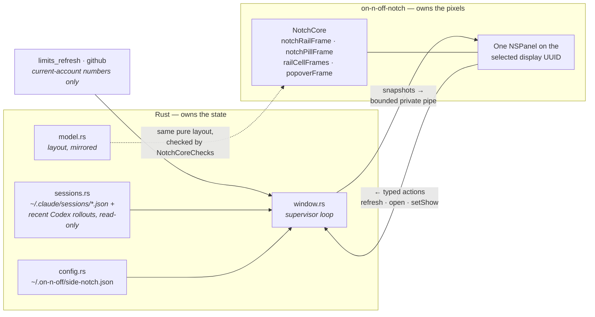

# The side notch

**Orientation, not a source of truth.** `src-tauri/src/side_notch/` and
`src-tauri/macos/SideNotch/` are authoritative.

An opt-in overlay that keeps quota rings and pull requests visible without the app window being
open. It is the only part of the product that is not a WebView. It exists twice: on macOS as a
bundled helper executable, on Windows 11 as a window the app paints itself. Rust owns the settings
and the data on both, and both draw the same rail and popovers from the same layout maths.

## On macOS



Things that are easy to get wrong:

- **Rust owns settings and data; the helper owns drawing.** The settings card stays in
  `ui/src/features/notch/`. The helper reports typed actions and never edits configuration
  directly.
- **The display is chosen explicitly, by UUID.** A disconnected or mirrored selection hides the
  notch rather than falling back to another screen — silently moving it is worse than not showing.
- **The layout maths exists twice on purpose**, in `NotchCore` (Swift) and `side_notch/model.rs`
  (Rust), so Rust can reason about geometry without calling into AppKit. `NotchCoreChecks` exists
  to keep the two in step; if you change one, change both. Windows draws straight from
  `model.rs`, so a change there moves both platforms.
- **Nothing sensitive crosses the pipe** — current-account numbers, session rows, PR rows. No
  credentials, no network listener. PR rows open in the browser and copy a link to the pasteboard;
  the helper never writes to GitHub.
- **The helper is invisible to ordinary screenshots.** Verify it with the `--render` PNG path and
  `scripts/check-native-notch.mjs`, not with `screencapture`.

Built by `native_build.rs` on macOS only and bundled through `tauri.macos.conf.json`. Native
checks run without an Xcode XCTest dependency:

```sh
xcrun swift run --package-path src-tauri/macos/SideNotch NotchCoreChecks
bun scripts/check-native-notch.mjs   # after a Rust build
```

## On Windows

There is no helper and no second executable. `win_window.rs` owns one transparent, always-on-top,
non-activating `tao` window per selected display and presents it with `UpdateLayeredWindow`;
`win_paint.rs` draws the rail, the marks and the popovers into a tiny-skia pixmap; `win_displays.rs`
enumerates monitors; and `win_host.rs` is the `window.rs` supervisor with in-process channels where
macOS has pipes. The display is chosen by device name rather than UUID, and the same rule holds —
a disconnected or mirrored selection hides the notch. Windows 11 is the floor
(`CurrentBuildNumber` >= 22000); the settings card says so on older builds.

`OS.md` carries the Windows behaviours that decide whether this works at all — the bare `WS_POPUP`
style, per-pixel-alpha hit testing, the pointer poll that stands in for the `CursorMoved` events
tao never sends, and pixel alignment on fractional display scaling. Read it before changing
`win_window.rs`.

**Typography is measured, not eyeballed.** The overlay sits next to the app's own window, so any
mismatch in face, weight or antialiasing reads instantly as the wrong font. `win_paint/text.rs`
therefore re-treads the path the WebView takes rather than forming its own opinion: the face
DirectWrite hands the WebView for a weight (Segoe UI ships no 500, and DirectWrite steps a 500
request *up* onto semibold, so the app's `font-medium` renders semibold on both sides), the
ClearType 3x1 texture collapsed by sRGB luminance the way Skia does for a grayscale alpha mask, and
the sRGB display exponent applied to that linear coverage before blending. Marks beside a title
centre on the cap band, which is where SF Pro's line box lands and where Segoe UI's does not.

`win_paint::visual::specimen` renders every size and weight on one sheet so it can be checked
against the real thing: rebuild the same rows as HTML and render them with `msedge --headless`,
once plain and once with `--disable-lcd-text`, which brackets what the WebView does. Advance widths
and ink centroids should match outright, total ink to a few per cent. Measure alpha-weighted — a
premultiplied PNG read as RGB reports every partial pixel as solid and will tell you the text is
far harder than it is.
